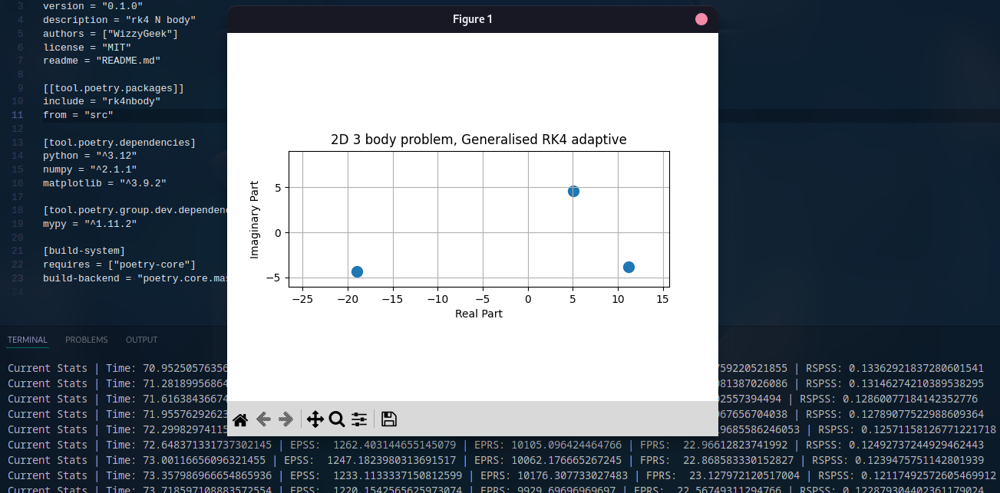

# RK4 N-Body

Naive simulation of N-Body simulation with runge-kutta fourth order method

## Features

- A 30k frames per second simulation
- A 25 fps graphical visualisation
- Custom Runge Kutta implementation, which supports solving system of any order with any
number of variables (Coefficients also swappable)
- Very simple and easy to understand

## Try it out

Install this repository with pip

```
pip install git+https://github.com/WizzyGeek/orbits.git@master
```

```
python -m rk4nbody
```

## Screenshot


